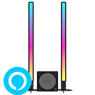

<p align="center">
    <a href='https://govee.com/' rel='nofollow'>
        </a>br>
        
    </a>
</p>

# Govee Sync

A Govee DreamSync replacement for the H6047 that isn't Chinese spyware.

## Build

### Windows

#### Requirements

| Tool               | Minimum Version |
|--------------------|-----------------|
| Cmake              | 3.22.1          |
| Qt                 | 6.2.4           |
| Visual Studio 2022 | 17.9.2          |

#### Build

```bash
mkdir build && cd build
cmake -DCMAKE_BUILD_TYPE=Release ..

```

### Ubuntu 22.04

#### Requirements

| Tool  | Minimum Version |
|-------|-----------------|
| Cmake | 3.22.1          |
| Qt    | 6.2.4           |
| g++   | 11.4.0          |

## Reference

[Govee Developer API Reference](https://govee-public.s3.amazonaws.com/developer-docs/GoveeDeveloperAPIReference.pdf)